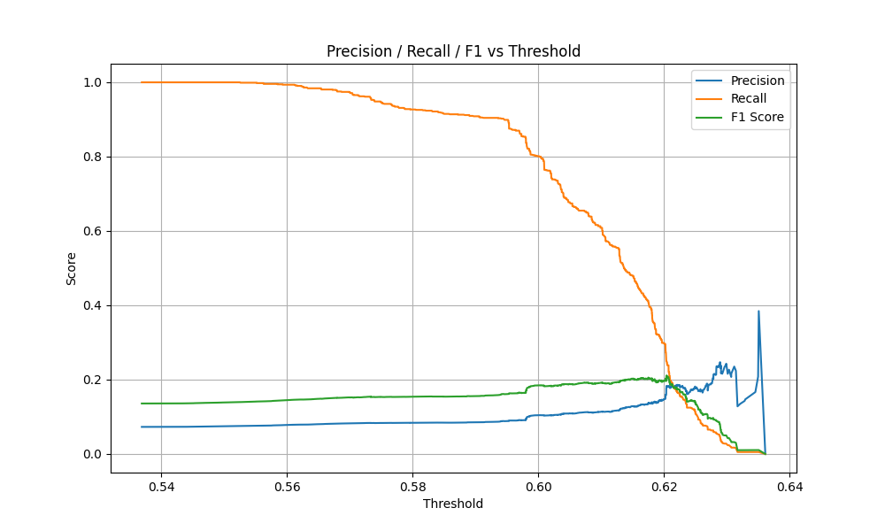
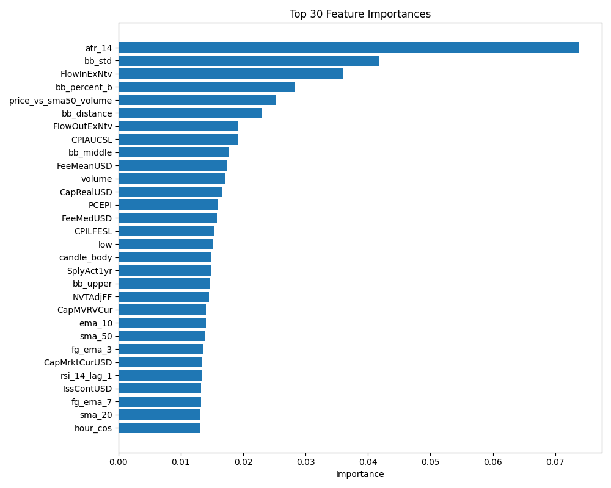

# BTC-ML-Pipeline: 比特幣現貨交易預測系統

## 專案概述

這是一個完整的端到端機器學習管道，於預測比特幣價格走勢並最終實現中頻交易策略。

> 本專案作為自我學習與技術實踐的成果，目前仍在持續優化中。最新版本(v0.5)已實現F1分數的顯著提升，完整的機器學習管道運行穩定可靠。

> 未來待模型穩定後，將以微服務架構實現交易服務，串接交易所API及用戶買賣通知等功能。

## 系統架構

```
btc-ml-pipeline/
├── data/                 # 數據層：原始、處理與訓練數據
├── models/               # 模型層：儲存訓練完成的模型
├── output/               # 輸出層：分析結果、預測與評估指標
└── src/                  # 核心邏輯層
    ├── analysis/         # 分析模組：特徵重要性分析
    ├── evaluate/         # 評估模組：模型性能評估
    ├── predict/          # 預測模組：模型推論與閾值優化
    ├── processing/       # 數據處理：清洗、特徵工程
    ├── train/            # 模型訓練：時序交叉驗證、超參數優化
    ├── visualization/    # 視覺化：績效圖表生成
    └── config.py         # 中央配置：系統參數與路徑管理
```

## 核心技術棟

* **Data Processing**: Pandas 2.2.2 用於高效數據處理與轉換
* **Exchange API**: CCXT 4.1.48 提供標準化交易所接口
* **ML Framework**: XGBoost 2.1.4 + Scikit-learn 1.3.2 處理時序預測
* **Visualization**: Matplotlib 3.7.2 產生高質量分析圖表
* **Configuration**: 環境變量配合中央 config.py 管理

## 特徵工程分類

### 鏈上數據 (On-Chain Data)

本專案整合了 CoinMetrics 提供的比特幣鏈上數據，包括：

* 交易量指標: `tx_volume`, `tx_volume_ma_30`, `tx_volume_ma_90`
* 活躍地址: `active_addresses`, `active_addresses_ma_30`, `active_addresses_ma_90`
* 礦工指標: `miner_revenue`, `miner_revenue_ma_30`, `miner_revenue_ma_90`
* 鏈上交易: `tx_count`, `tx_count_ma_30`, `tx_count_ma_90`
* 鏈上費用: `tx_fees`, `tx_fees_ma_30`, `tx_fees_ma_90`

> 鏈上數據來源於 [CoinMetrics Data](https://github.com/coinmetrics/data)，使用者需自行下載並放置於 `data/onchain/` 目錄下。

## 特徵重要性分類

根據模型特徵重要性分析，我們將特徵分為以下幾類（按重要性排序）：

### 高重要性特徵 (重要性 > 0.03)

* 技術指標:
  - `atr_14` (0.0738) - 平均真實範圍，衡量市場波動性
  - `bb_std` (0.0419) - 布林帶標準差
  - `bb_percent_b` (0.0282) - 布林帶百分比位置
  - `bb_distance` (0.0230) - 價格與布林帶距離
  - `bb_middle` (0.0177) - 布林帶中軌

* 鏈上數據:
  - `FlowInExNtv` (0.0360) - 流入交易所原生代幣量
  - `FlowOutExNtv` (0.0192) - 流出交易所原生代幣量
  - `FeeMeanUSD` (0.0174) - 平均交易費用（美元）
  - `CapRealUSD` (0.0166) - 實際市值（美元）
  - `FeeMedUSD` (0.0157) - 中位數交易費用（美元）

* 經濟指標:
  - `CPIAUCSL` (0.0192) - 消費者物價指數
  - `PCEPI` (0.0159) - 個人消費支出物價指數
  - `CPILFESL` (0.0153) - 核心消費者物價指數

### 中重要性特徵 (0.015 > 重要性 > 0.01)

* 價格/量體指標:
  - `volume` (0.0171) - 交易量
  - `low` (0.0151) - 最低價
  - `candle_body` (0.0149) - K線實體
  - `close` (0.0124) - 收盤價
  - `high` (0.0109) - 最高價

* 技術指標:
  - `ema_10` (0.0140) - 10日指數移動平均
  - `sma_50` (0.0139) - 50日簡單移動平均
  - `rsi_14_lag_1` (0.0134) - 滯後RSI指標
  - `sma_20` (0.0131) - 20日簡單移動平均

* 情緒指標:
  - `fg_ema_3` (0.0136) - 恐懼貪婪指數3日EMA
  - `fg_ema_7` (0.0132) - 恐懼貪婪指數7日EMA
  - `fear_greed_value` (0.0116) - 恐懼貪婪指數值

* 時間特徵:
  - `hour_cos` (0.0131) - 小時餘弦轉換
  - `hour` (0.0120) - 小時
  - `weekday_sin` (0.0113) - 星期正弦轉換
  - `weekday` (0.0109) - 星期

### 低重要性特徵 (重要性 < 0.01)

* 技術指標:
  - `macd_line` (0.0093) - MACD線
  - `sma_100` (0.0083) - 100日簡單移動平均
  - `macd_hist` (0.0086) - MACD柱狀圖
  - `macd_signal` (0.0067) - MACD信號線

* 鏈上指標:
  - `AdrBalUSD100KCnt` (0.0118) - 持有超過10萬美元地址數
  - `AdrActCnt` (0.0107) - 活躍地址數
  - `TxTfrCnt` (0.0098) - 轉帳交易數
  - `AdrBalUSD1MCnt` (0.0089) - 持有超過100萬美元地址數

* 其他指標:
  - `FEDFUNDS` (0.0094) - 聯邦基金利率
  - `volume_ma_20` (0.0097) - 20日交易量移動平均
  - `fg_zscore_30` (0.0083) - 恐懼貪婪指數30日Z分數

> 註：括號中的數值代表特徵重要性得分，數值越高表示該特徵對模型預測的貢獻越大。

## 模型評估與分析
### Precision / Recall / F1 閾值分析


### 前三十特徵模型



### 模型效能比較
| 版本 |日期 | 特徵策略 | 調整內容 | Accuracy | Precision | Recall | F1 Score | 備註 |
|:----------:|:----------:|:----------:|:-----------------|:--------:|:---------:|:---------:|:---------:|:---------------------------|
| v0.5 | 2025-05-18 |85 | 新增BTC鍊上資料 | 0.8642 | 0.1833| 0.2495| 0.2113| 新增鏈上特徵顯著降低誤判率，精準度提升，整體模型表現最穩定 |
| v0.4 | 2025-05-05 |Top 40 | 調整XGBoost模型參數 | 0.6718 | 0.1216| 0.5603| 0.1999| 透過交叉驗證獲得最佳模型參數，大幅提升召回率 |
| v0.3 | 2025-05-04 |Top 30(FERD)| 加入經濟指標 | 0.7578| 0.1109 | 0.3287 | 0.1658 | FERD 幫助提高 precision & F1 |
| v0.2 | 2025-05-01 |Top 30 | 預設模型前三十特徵 | 0.7790| 0.1050 | 0.2683 | 0.1510 | 精簡特徵，整體平衡更佳 |
| v0.1 | 2025-05-01 |All (60) | 預設模型 | 0.6318 | 0.0889 | 0.4353 | 0.1476 | 高召回率，但誤判多 |

### 混淆矩陣分析
| 模型版本 | TN | FP | FN | TP | 備註 |
|:--------:|:-----:|:-----:|:---:|:---:|:------------------------------|
| v0.5 | 10790 | 1034 | 698 | 232 |整體精度達最高，新增鍊上資料後，TP 提升穩定但仍受限資料不平衡；FP 下降，模型更保守預測  |
| v0.4 | 8003 | 3755 | 408 | 520 | 真陽性數量大幅提升，雖FP增加但召回率顯著提高 |
| v0.3 | 9335 | 2423 | 643 | 285 | Recall 提升 15%、FP 略增 |
| v0.2 | 9623 | 2122 | 679 | 249 | 精準度大幅提升，但略損召回敏感度 |
| v0.1 | 7603 | 4142 | 524 | 404 | 容易誤判買入信號（高FP） |
## 未來發展路線

### 1. 模型優化

* 持續改進特徵工程，尋找最具預測力的特徵組合
* 調整模型超參數或嘗試其他模型架構
* 整合情緒分析與鏈上數據作為補充特徵

### 2. 架構增強

* 引入Docker容器化部署方案
* 實現事件驅動的微服務架構
* 開發RESTful API介面與監控儀表板

### 3. 交易策略

* 升級為中頻交易策略引擎
* 實現完整回測系統與紀效分析
* 整合交易所API實現自動化交易

## 快速開始

### 環境要求

* Python 3.9+

### 數據準備

1. 下載 CoinMetrics 鏈上數據：
   ```bash
   # 克隆 CoinMetrics 數據倉庫
   git clone https://github.com/coinmetrics/data.git
   
   # 複製 BTC 鏈上數據到專案目錄
   mkdir -p data/onchain
   cp data/csv/btc.csv data/onchain/
   ```

2. 確保數據目錄結構如下：
   ```
   btc-ml-pipeline/
   ├── data/
   │   ├── onchain/        # 鏈上數據
   │   │   └── btc.csv     # CoinMetrics BTC 數據
   │   ├── raw/            # 原始數據
   │   └── processed/      # 處理後數據
   ```

### 安裝

```bash
# 克魯倉庫
git clone https://github.com/LoShinYen/btc-ml-pipeline.git
cd btc-ml-pipeline

# 建立虛擬環境
py -3.9 -m venv venv

# 啟動虛擬環境
.\venv\Scripts\Activate

# 安裝依賴
pip install -r requirements.txt

# 執行完整管道
python main.py
```

### 配置

系統使用環境變量與配置檔管理參數，主要配置在 `src/config.py`：

* 交易所設定（交易對、時間週期）
* 數據路徑管理
* 特徵選擇配置
* 模型參數設定

## 貢獻與聯繫

歡迎通過以下方式參與專案開發：

* 提交Issue報告問題或建議功能
* Fork專案並提交Pull Request
* 聯繫作者討論合作機會


## License

This project is licensed under the Apache License 2.0 - see the [LICENSE](./LICENSE) file for details.
