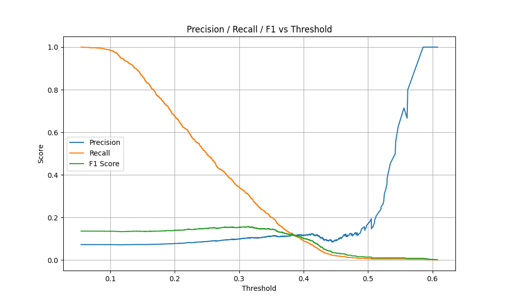
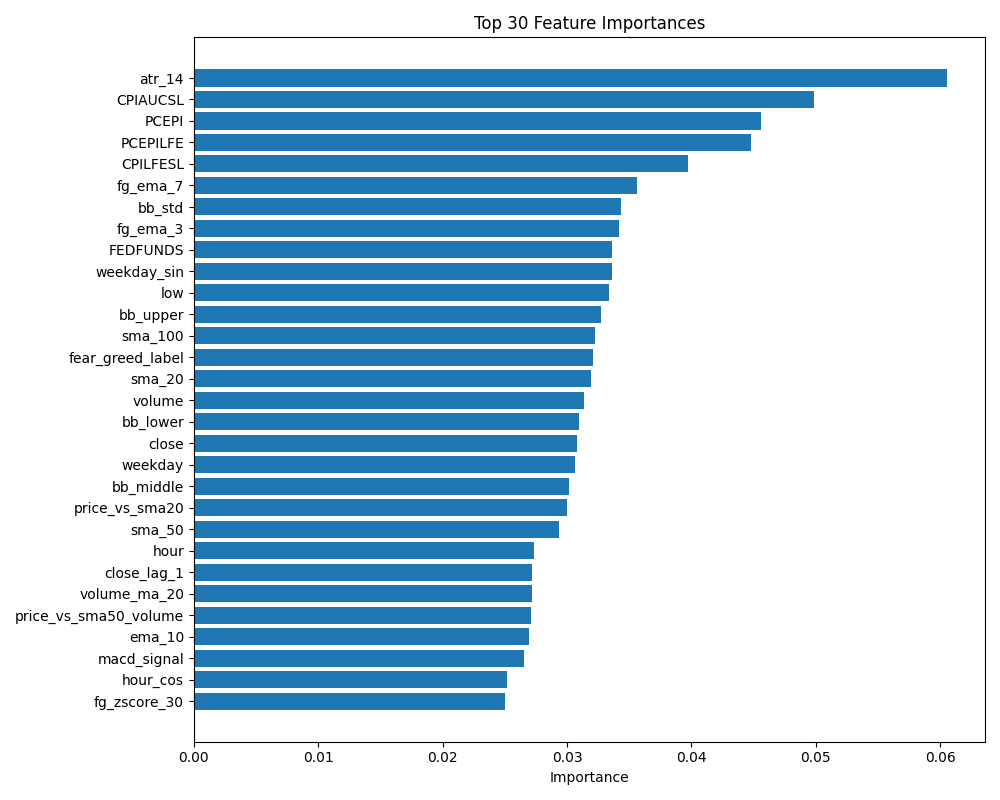

# BTC-ML-Pipeline: 比特幣現貨交易預測系統

## 專案概述

這是一個完整的端到端機器學習管道，旨在預測比特幣價格走勢並最終實現中頻交易策略。專案包含完整的數據收集（目前已整合BTC 1小時K線和恐懼貪婪指數）、處理、特徵工程、模型訓練、預測與評估流程。

> 本專案作為自我學習與技術實踐的成果，目前仍在持續優化中。雖然當前F1分數較低，但完整的機器學習管道已可靠運行，關注點在於系統架構與數據流程的完整性。

> 未來待模型穩定後，將以微服務架構實現交易服務，串接交易所API及用戶買賣通知等功能。

## 系統架構

採用模組化分層設計，確保各元件鬆散耦合、高內聚，易於維護與擴展：

```
btc-ml-pipeline/
├── data/                 # 數據層：原始、處理與訓練數據
├── models/               # 模型層：儲存訓練完成的模型
├── output/               # 輸出層：分析結果、預測與評估指標
└── src/                  # 核心邏輯層
    ├── analysis/         # 分析模組：特徵重要性分析
    ├── evaluate/         # 評估模組：模型性能評估
    ├── predict/          # 預測模組：模型推論與閾值優化
    ├── processing/       # 數據處理：清洗、特徵工程
    ├── train/            # 模型訓練：時序交叉驗證、超參數優化
    ├── visualization/    # 視覺化：績效圖表生成
    └── config.py         # 中央配置：系統參數與路徑管理
```

## 核心技術棧

- **Backend Framework**: 基於可擴展的模組化架構，採用事件驅動設計模式
- **Data Processing**: Pandas 2.2.2 用於高效數據處理與轉換
- **Exchange API**: CCXT 4.1.48 提供標準化交易所接口
- **ML Framework**: XGBoost 2.1.4 + Scikit-learn 1.3.2 處理時序預測
- **Configuration**: 基於環境變量的配置管理、依賴注入設計
- **Visualization**: Matplotlib 3.7.2 生成高質量分析圖表
- **Pipeline Orchestration**: 主流程控制與異常處理機制

## 模型評估與分析

<!-- ### Precision / Recall / F1 閾值分析 -->

### Precision / Recall / F1 閾值分析


### 前三十特徵模型



### 模型效能比較

| 特徵數量 | Accuracy | Precision | Recall | F1 Score | 備註 |
|:--------:|:--------:|:---------:|:------:|:--------:|:-----|
| All (60) | 0.6318   | 0.0889    | **0.4353** | 0.1476   | 高召回率，但誤判多 |
| Top 30   | **0.7790** | **0.1050** | 0.2683 | **0.1510** | 精簡特徵，整體平衡更佳 |
| Top 30(FERD)  | **0.7578** | **0.1109** | 0.3287 | **0.1658** | FERD 幫助提高 precision & F1 |


### 混淆矩陣分析

| 模型版本 | TN | FP | FN | TP | 備註 |
|:--------:|:--:|:--:|:--:|:--:|:-----|
| All      | 7603 | 4142 | 524  | 404 | 容易誤判買入信號（高FP） |
| Top 30   | **9623** | **2122** | 679  | 249 | 精準度大幅提升，但略損召回敏感度 |
| Top 30(FERD)   | **9335** | **2423** | 643  | 285 |Recall 提升 15%、FP 稍增加  |

雖然模型當前F1分數不高，但系統提供了完整的評估框架，可透過閾值調整平衡精確率與召回率的權衡。模型評估系統能夠：

- 實時監控模型性能指標
- 自動尋找最佳預測閾值
- 生成詳細的混淆矩陣分析報告
- 提供可視化的模型績效圖表

## 未來發展路線

### 1. 模型優化
- 持續改進特徵工程，尋找最具預測力的特徵組合
- 調整模型超參數或嘗試其他模型架構
- 整合情緒分析與鏈上數據作為補充特徵

### 2. 架構增強
- 引入Docker容器化部署方案
- 實現事件驅動的微服務架構
- 開發RESTful API介面與監控儀表板

### 3. 交易策略
- 升級為中頻交易策略引擎
- 實現完整回測系統與績效分析
- 整合交易所API實現自動化交易

## 快速開始

### 環境要求
- Python 3.9+

### 安裝

```bash
# 克隆倉庫
git clone https://github.com/LoShinYen/btc-ml-pipeline.git
cd btc-ml-pipeline

# 建置虛擬環境
py -3.9 -m venv venv

# 啟動虛擬環境
.\venv\Scripts\Activate

# 安裝依賴
pip install -r requirements.txt

# 執行完整管道
python main.py
```

### 配置

系統使用環境變量與配置檔案管理參數，主要配置在`src/config.py`：

- 交易所設定（交易對、時間週期）
- 數據路徑管理
- 特徵選擇配置
- 模型參數設定

## 貢獻與聯繫

歡迎通過以下方式參與專案開發：

- 提交Issue報告問題或建議功能
- Fork專案並提交Pull Request
- 聯繫作者討論合作機會


