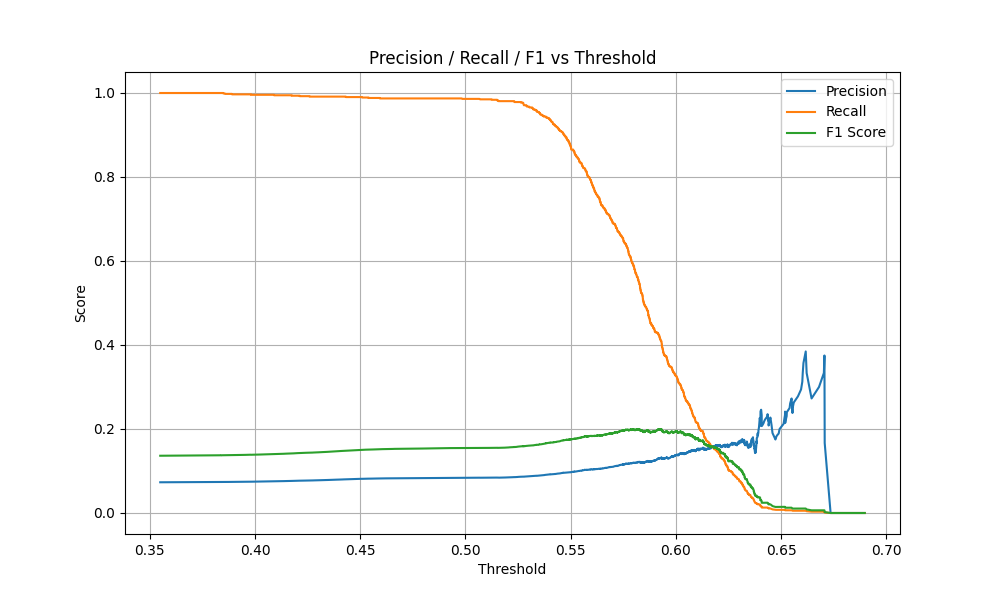
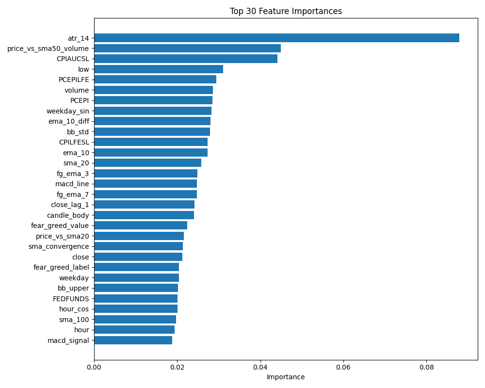

# BTC-ML-Pipeline: 比特幣現貨交易預測系統

## 專案概述

這是一個完整的端到端機器學習管道，於預測比特幣價格走勢並最終實現中頻交易策略。

> 本專案作為自我學習與技術實踐的成果，目前仍在持續優化中。最新版本(v0.4)已實現F1分數的顯著提升，完整的機器學習管道運行穩定可靠。

> 未來待模型穩定後，將以微服務架構實現交易服務，串接交易所API及用戶買賣通知等功能。

## 系統架構

```
btc-ml-pipeline/
├── data/                 # 數據層：原始、處理與訓練數據
├── models/               # 模型層：儲存訓練完成的模型
├── output/               # 輸出層：分析結果、預測與評估指標
└── src/                  # 核心邏輯層
    ├── analysis/         # 分析模組：特徵重要性分析
    ├── evaluate/         # 評估模組：模型性能評估
    ├── predict/          # 預測模組：模型推論與閾值優化
    ├── processing/       # 數據處理：清洗、特徵工程
    ├── train/            # 模型訓練：時序交叉驗證、超參數優化
    ├── visualization/    # 視覺化：績效圖表生成
    └── config.py         # 中央配置：系統參數與路徑管理
```

## 核心技術棟

* **Data Processing**: Pandas 2.2.2 用於高效數據處理與轉換
* **Exchange API**: CCXT 4.1.48 提供標準化交易所接口
* **ML Framework**: XGBoost 2.1.4 + Scikit-learn 1.3.2 處理時序預測
* **Visualization**: Matplotlib 3.7.2 產生高質量分析圖表
* **Configuration**: 環境變量配合中央 config.py 管理

## 特徵工程分類

### Top 30 特徵 (TOP\_SELECTED\_FEATURES\_30)

* 技術指標: `atr_14`, `ema_10`, `sma_20`, `sma_50`, `sma_100`, `macd_signal`, `bb_std`, `bb_upper`, `bb_lower`, `bb_middle`, `price_vs_sma20`, `price_vs_sma50_volume`
* 價格/量體: `close`, `low`, `volume`, `volume_ma_20`, `close_lag_1`
* 經濟指標: `CPIAUCSL`, `CPILFESL`, `PCEPILFE`, `PCEPI`, `FEDFUNDS`
* 情緒指標: `fear_greed_label`
* 時間元素: `weekday`, `weekday_sin`, `hour`, `hour_cos`
* 自製特徵: `fg_ema_3`, `fg_ema_7`, `fg_zscore_30`

### Top 40 特徵 (TOP\_SELECTED\_FEATURES\_40)

執行 Top 30 執行基礎上，加入:

* 技術指標: `rsi_14_lag_1`, `ema_10_diff`, `sma_convergence`, `macd_line`, `bb_distance`
* 價格/量體: `candle_body`, `open_zscore`, `high_zscore`, `low_zscore`
* 情緒指標: `fear_greed_value`

## 模型評估與分析
### Precision / Recall / F1 閾值分析


### 前三十特徵模型



### 模型效能比較
| 版本 |日期 | 特徵策略 | 調整內容 | Accuracy | Precision | Recall | F1 Score | 備註 |
|:----------:|:----------:|:----------:|:-----------------|:--------:|:---------:|:---------:|:---------:|:---------------------------|
| v0.4 | 2025-05-05 |Top 40 | 調整XGBoost模型參數 | 0.6718 | 0.1216| 0.5603| 0.1999| 透過交叉驗證獲得最佳模型參數，大幅提升召回率 |
| v0.3 | 2025-05-04 |Top 30(FERD)| 加入經濟指標 | 0.7578| 0.1109 | 0.3287 | 0.1658 | FERD 幫助提高 precision & F1 |
| v0.2 | 2025-05-01 |Top 30 | 預設模型前三十特徵 | 0.7790| 0.1050 | 0.2683 | 0.1510 | 精簡特徵，整體平衡更佳 |
| v0.1 | 2025-05-01 |All (60) | 預設模型 | 0.6318 | 0.0889 | 0.4353 | 0.1476 | 高召回率，但誤判多 |

### 混淆矩陣分析
| 模型版本 | TN | FP | FN | TP | 備註 |
|:--------:|:-----:|:-----:|:---:|:---:|:------------------------------|
| v0.4 | 8003 | 3755 | 408 | 520 | 真陽性數量大幅提升，雖FP增加但召回率顯著提高 |
| v0.3 | 9335 | 2423 | 643 | 285 | Recall 提升 15%、FP 略增 |
| v0.2 | 9623 | 2122 | 679 | 249 | 精準度大幅提升，但略損召回敏感度 |
| v0.1 | 7603 | 4142 | 524 | 404 | 容易誤判買入信號（高FP） |
## 未來發展路線

### 1. 模型優化

* 持續改進特徵工程，尋找最具預測力的特徵組合
* 調整模型超參數或嘗試其他模型架構
* 整合情緒分析與鏈上數據作為補充特徵

### 2. 架構增強

* 引入Docker容器化部署方案
* 實現事件驅動的微服務架構
* 開發RESTful API介面與監控儀表板

### 3. 交易策略

* 升級為中頻交易策略引擎
* 實現完整回測系統與紀效分析
* 整合交易所API實現自動化交易

## 快速開始

### 環境要求

* Python 3.9+

### 安裝

```bash
# 克魯倉庫
git clone https://github.com/LoShinYen/btc-ml-pipeline.git
cd btc-ml-pipeline

# 建立虛擬環境
py -3.9 -m venv venv

# 啟動虛擬環境
.\venv\Scripts\Activate

# 安裝依賴
pip install -r requirements.txt

# 執行完整管道
python main.py
```

### 配置

系統使用環境變量與配置檔管理參數，主要配置在 `src/config.py`：

* 交易所設定（交易對、時間週期）
* 數據路徑管理
* 特徵選擇配置
* 模型參數設定

## 貢獻與聯繫

歡迎通過以下方式參與專案開發：

* 提交Issue報告問題或建議功能
* Fork專案並提交Pull Request
* 聯繫作者討論合作機會
